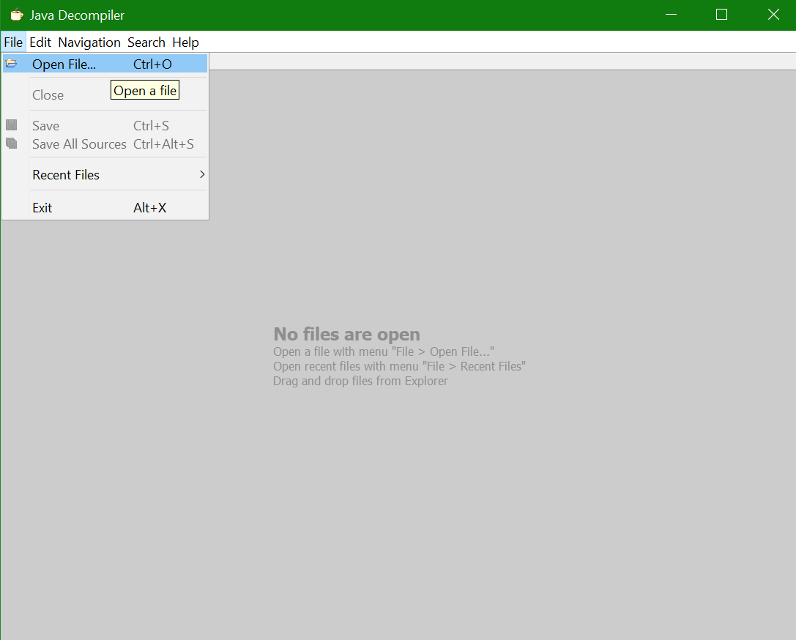
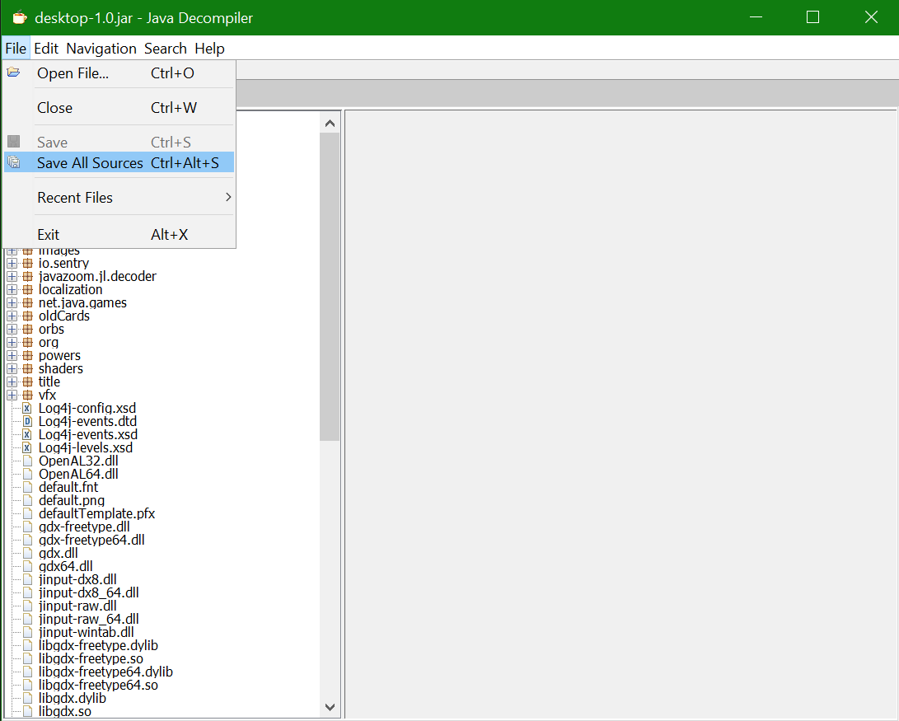

Decompiling the game will allow you to (essentially) look at the game's source code. This isn't necessary for modding if you only use BaseMod's subscription system. However, it is a very useful tool for

* Writing your own [patches](patches.md)
* Figuring out how different classes in the game work
* Figuring out where BaseMod's hooks are and when they are called
* Doing any modding beyond what BaseMod currently provides

Follow these steps to decompile the game:

1. Download the [JD-GUI Java Decompiler](http://jd.benow.ca/). Click the download tab and then grab the `.jar` version which will look something like `jd-gui-1.4.0.jar`
2. Launch JD-GUI with `jd-gui.exe` and then when it prompts you to find a jar to decompile go ahead and navigate to your **Slay The Spire** folder and select `desktop-1.0.jar`. If it does not automatically prompt you go to *File* -> *Open File...* 
3. This will open a view in which you can look at the decompiled source code.
4. Click *File* -> *Save All Sources* and save everything as `desktop-1.0.jar.src.zip` wherever you are going to be doing your modding. The output will be a `zip` file which you will then have to unzip to access all of the source code (note that it is not actual source code - just reconstructed source code by the decompiler). 

