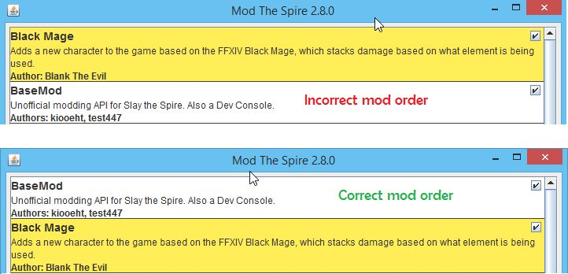

## Playing With Mods

### Are you on the beta branch of Slay the Spire?

Switch out of beta mode

> Both [ModTheSpire](https://github.com/kiooeht/ModTheSpire) and [BaseMod](https://github.com/daviscook477/BaseMod) **DO NOT** officially support beta. Since almost all mods rely on one or both of these mods, there is **no guarantee** that the mod(s) you are playing with will work on beta.

### Do you have the latest version of ModTheSpire and BaseMod?

The latest releases for ModTheSpire and BaseMod can be found [here](https://github.com/kiooeht/ModTheSpire/releases/latest) and [here](https://github.com/daviscook477/BaseMod/releases/latest).

### Do you have the latest version of Slay the Spire?

Update through Steam.

### Is it Thursday or Friday (Or sometimes Saturday)?

Check if all of the mods you are playing with (especially BaseMod) have been updated for the latest patch of Slay the Spire.

> The developers of Slay the Spire release a weekly patch every Thursday. The patch often breaks something in BaseMod, ModTheSpire, or the mod(s) you are trying to play with. It takes time to update mods, so have patience while the mod developers update their mods to be compatible with the latest patch.

>*Are you a developer?* Consider creating a pull request to make the mod compatible with the latest patch. While you're at it, hang out with the modding community on [Discord](https://discord.gg/VC6kRNu).

### Are your folders set up correctly for mods?

Your folder setup should look something like this:

```
SlayTheSpire/
    mods/
        Mod1.jar
        Mod2.jar
    desktop-1.0.jar
    ModTheSpire.jar
    MTS.cmd (if on PC)
    MTS.sh (if on Linux)
    ...
```
or this, if you're on Mac:

```
SlayTheSpire/
    SlayTheSpire.app/
        Contents/
            Info.plist
            MacOS/
                run.sh
            Resources/
                mods/
                    mod1.jar
                    mod2.jar
                desktop-1.0.jar
                ModTheSpire.jar
                MTS.sh
```

### Are you starting the game with the script?

Start Slay the Spire with `MTS.cmd` if you are playing on PC and `MTS.sh` if you are playing on Linux.

### NoSuchMethodError

If you see the following error, you are most likely running ModTheSpire with Java 9 or 10. ModTheSpire does not work on Java 9 or 10 and requires Java 8. If you start ModTheSpire [using the script](#are-you-starting-the-game-with-the-script?) you will automatically be using the install of Java 8 that Slay the Spire ships with.
```
Exception in thread "Thread-2" java.lang.NoSuchMethodError: sun.reflect.ReflectionFactory.newConstructorAccessor(Ljava/lang/reflect/Constructor;)Lsun/reflect/ConstructorAccessor;
at com.evacipated.cardcrawl.modthespire.EnumBusterReflect.findConstructorAccessor(EnumBusterReflect.java:211)
at com.evacipated.cardcrawl.modthespire.EnumBusterReflect.make(EnumBusterReflect.java:70)
at com.evacipated.cardcrawl.modthespire.EnumBusterReflect.make(EnumBusterReflect.java:49)
at com.evacipated.cardcrawl.modthespire.Patcher.patchEnums(Patcher.java:125)
at com.evacipated.cardcrawl.modthespire.Loader.runMods(Loader.java:237)
at com.evacipated.cardcrawl.modthespire.ui.ModSelectWindow.lambda$null$1(ModSelectWindow.java:199)
at java.base/java.lang.Thread.run(Unknown Source)
```

### Crash after clicking the Play button

You may encounter this crash after clicking the Play button with several mods selected.
```
Initializing mods...
java.lang.reflect.InvocationTargetException
	at sun.reflect.NativeMethodAccessorImpl.invoke0(Native Method)
	at sun.reflect.NativeMethodAccessorImpl.invoke(NativeMethodAccessorImpl.java:62)
	at sun.reflect.DelegatingMethodAccessorImpl.invoke(DelegatingMethodAccessorImpl.java:43)
	at java.lang.reflect.Method.invoke(Method.java:498)
```

Make sure BaseMod is the first mod in the modlist for ModTheSpire, like so:


## Developing Mods

This is a troubleshooting guide to help solve some of the most common issues when developing your first mod. If you are not developing a mod and are simply trying to play Slay the Spire with mods, read the [Playing With Mods](#playing-with-mods) section above.

If you are looking for a tutorial on writing your first mod, check out the [Getting Started Guide](getting-started.md)

All of the steps in the [Playing With Mods](#playing-with-mods) section apply as well.

### Did you package your mod into a `.jar` file?

You should be packaging your mod into a `.jar` file and placing that `.jar` file into the mods folder where you play Slay the Spire.

You can package your mod through the command line with `mvn package` or through built in tools in IntelliJ or Eclipse.

### Are you trying to recompile the decompiled source code?

***Don't.***

Follow the instructions on how to package your mod with Maven in the [Getting Started Guide](getting-started.md#package-the-skelaton-app)

### Did you follow the troubleshooting steps for playing with mods?

Those start at the [top](#playing-with-mods) of the page. All of those steps apply as well.